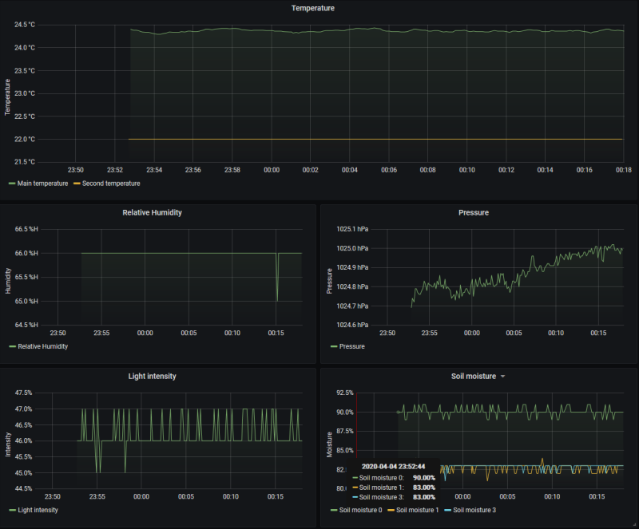

# BLE Garduino with Grafana support

Monitor various sensor data provided by an Arduino+BLE on a RPi via Grafana and InfluxDB.

Currently supported sensors:

| Model                      | Function              |
| -------------------------- | --------------------- |
| BMP280                     | temperature, pressure |
| DHT11                      | temperature, humidity |
| light diode                | light intensity       |
| resistive moisture sensors | soil moisture         |

Here an example how the data representation with Grafana looks like:



## Setup

### Receiver

The setup of the data receiver side is docker-compose based and thus the installation quite straight forward:

```bash
# create volumes manually, as these are declared
# external in the compose file
$ docker volume create --name=grafana-volume
$ docker volume create --name=influxdb-volume

# spin up the system
$ docker-compose up -d
```

Now docker-compose should pull and build all necessary container and start the system. It can take a few minutes until everything is initialized.

Afterwards an influxdb database must created. To get started with influxdb have a look [here](https://docs.influxdata.com/influxdb/v1.7/introduction/getting-started/). As the database is running within a docker container the described CLI is probably not available on the host PC, one easy way to create a db is to use the Python client as described [here](https://www.influxdata.com/blog/getting-started-python-influxdb/).

Then Grafana can be configured via its webpage. The page is available via http://[INSTERT IP OF DEVICE]:3000 and helps setting everything up (if there are any problems [here(https://grafana.com/docs/grafana/latest/features/datasources/influxdb/) is some help]). 

Finally the provided dashboard can be generated by the provided JSON model (doc/garduino_dashboard). Simply create a new dashboard, go to its settings and use the "JSON Model" function to import the provided dashboard via copy and paste.

### Transmitter

The transmitter is an Arduino based device which provides the sensor data to the database via a bluetooth low energy module ([DSD TECH Hm-17](http://www.dsdtech-global.com/search/label/hm-17)). The sensors must be calibrated before using them and the analog pins in the code must be adjusted depending on which pins the sensors hardware is actually connected.

Necessary external libraries:
- ArduinoJson
- SimpleDHT
- Adafruit_BMP280
